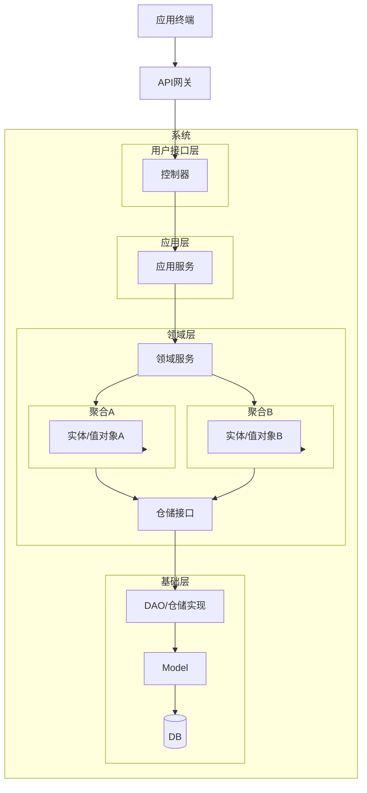

# gin-3at

餐饮电商的后端服务，采用单体应用架构，集成用户、商品、库存、订单和支付五大业务模块，实现基础电商功能，便于后续快速迭代和扩展。

- 领域驱动设计（DDD）架构
  - 分层架构设计，包含路由、处理器、服务、数据访问对象等
  - 支持数据模型和领域模型分离
- 支持集成测试
- 提供数据种子功能，便于开发和测试
- 提供测试工具包，便于编写和执行测试用例

## 技术选型

- 语言：Go 1.24.4
- 数据：Mysql
- 环境变量管理：[joho/godotenv](https://github.com/joho/godotenv)
- API 文档：Swagger
- 支持热重载：[cosmtrek/air](https://github.com/air-verse/air) 
- 工具：Makefile、Docker
- 测试：Go test

| 技术/组件                       | 版本    | 说明                   |
| ------------------------------- | ------- | ---------------------- |
| github.com/caarlos0/env/v11     | v11.3.1 | 环境变量管理           |
| github.com/gin-contrib/sessions | v1.0.4  | Gin 会话管理中间件     |
| github.com/gin-gonic/gin        | v1.10.1 | Web 框架（HTTP API）   |
| github.com/swaggo/files         | v1.0.1  | Swagger 静态文件支持   |
| github.com/swaggo/gin-swagger   | v1.6.0  | Gin 集成 Swagger UI    |
| github.com/swaggo/swag          | v1.16.4 | Swagger 注解与文档生成 |
| gorm.io/driver/mysql            | v1.6.0  | GORM MySQL 驱动        |
| gorm.io/gorm                    | v1.30.0 | ORM 框架               |

## Quick Start 

### 环境变量设置

```bash
cp .env.example .env
```

然后修改其中的配置项。

- 数据库连接配置

### 文档生成

```bash
swag init -g cmd/server/main.go
```

### 启动热重载服务

```bash
air -c .air.toml
```

### 执行测试脚本

```bash
godotenv -f .env go test -count=1 ./...
```

> `-count=1` 参数用于确保每次测试都从头开始执行，而不是使用缓存的结果。在执行 dao 测试需要。

## 目录结构

```
gin-3at
├── cmd                         # 主程序入口
├── docs                        # 文档相关 
├── go.mod                      # Go 模块文件
├── go.sum                      # Go 模块依赖文件
├── .air.toml                   # Air 热重载配置文件
├── .env.example                # 环境变量配置文件
├── internal                    # 内部包
│   ├── config                  # 配置管理
│   ├── router                  # 路由配置
│   ├── dto                     # 数据传输对象
│   ├── handler                 # HTTP 处理器
│   ├── service                 # 服务层
│   ├── domain                  # 领域模型
│   ├── dao                     # 数据访问对象
│   ├── model                   # 数据模型(po)
│   ├── pkg                     # 公共包
│   ├── seed                    # 数据库种子数据
│   ├── integration_test        # 集成测试
│   └── testutils               # 测试工具
└── README.md                   # 项目说明文档
```

## 架构图




## 功能

- [ ] 用户信息管理
  - [x] 用户注册
  - [x] 用户登录
  - [x] 用户登出
  - [ ] 用户信息查询
  - [ ] 用户信息更新
  - [x] 用户密码重置
- [ ] 菜单管理
  - [ ] 商品分类管理
    - [ ] 分类添加
    - [x] 分类查询
    - [ ] 分类更新
    - [ ] 分类删除
  - [ ] 商品管理
    - [ ] 商品添加
    - [x] 商品查询
    - [ ] 商品更新
    - [ ] 商品删除
- [ ] 订单管理
  - [x] 订单创建
  - [ ] 订单查询
  - [ ] 订单更新
  - [ ] 订单取消
- [ ] 支付集成
- [ ] 数据统计和分析
- [ ] 支持多语言和国际化

## 依赖的组件

### 库

- gin
  - gin-gonic/gin
  - gin-contrib/sessions
- db
  - gorm.io/gorm
  - gorm.io/driver/mysql
- 文档工具：swaggo
  - swaggo/swaggo
  - swaggo/files
- 配置管理：caarlos0/env/v11

### 命令行

- 环境变量管理：joho/godotenv
- 文档生成工具：swaggo
- 热重载：cosmtrek/air 
